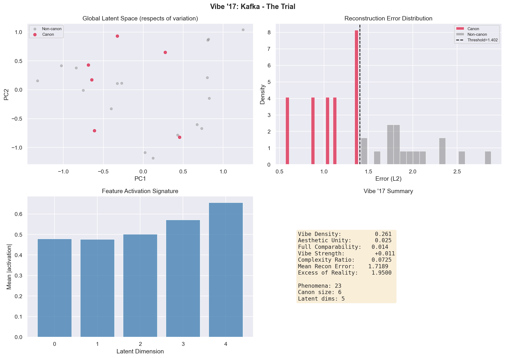
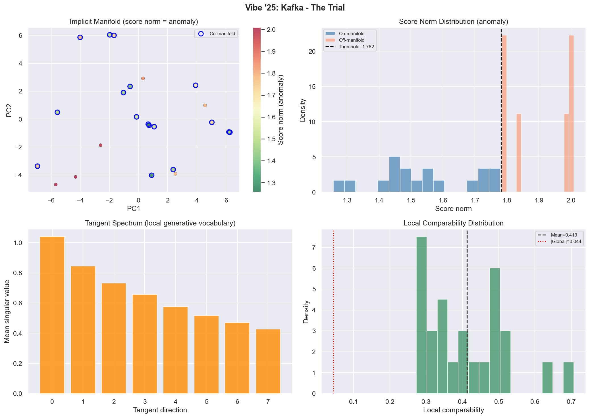

# Vibe Theory

### A Mathematical Derivation of Aesthetic Vibe from Text

Based on Peli Grietzer's *"A Theory of Vibe"* (Glass Bead, 2017) and his December 2025 update. This module implements two computational models that mathematically derive the **vibe** — the ambient aesthetic unity — of a given text or author's corpus.

---

## Table of Contents

1. [Quick Start](#1-quick-start)
2. [Usage](#2-usage)
3. [Theoretical Foundation](#3-theoretical-foundation)
4. [Mathematical Framework: Theory of Vibe '17 (VAE)](#4-mathematical-framework-theory-of-vibe-17-vae)
5. [Mathematical Framework: Theory of Vibe '25 (Diffusion)](#5-mathematical-framework-theory-of-vibe-25-diffusion)
6. [Architecture & Pipeline](#6-architecture--pipeline)
7. [Metrics Reference](#7-metrics-reference)
8. [Interpretation Guide](#8-interpretation-guide)
9. [References](#9-references)

---

## 1. Quick Start

```bash
# Clone and set up
git clone https://github.com/xraymemory/vibetheory.git
cd vibetheory
python3 -m venv .venv
source .venv/bin/activate
pip install -r requirements.txt

# Analyze a text file (VAE '17 model, default)
python vibetheory.py novel.txt

# Analyze with Theory of Vibe '25 (diffusion/manifold model)
python vibetheory.py --mode diffusion novel.txt

# Analyze inline text
python vibetheory.py --text "It was a dark and stormy night..."

# Compare two texts (cross-reconstruction)
python vibetheory.py --compare kafka.txt stein.txt

# Run the built-in demo (both models on Kafka + Stein)
python vibetheory.py --demo
```

---

## 2. Usage

### CLI Options

| Flag | Type | Default | Description |
|------|------|---------|-------------|
| `file` | positional | — | Path to text file |
| `--text`, `-t` | string | — | Analyze text provided directly |
| `--compare`, `-c` | 2 files | — | Compare vibes of two text files |
| `--demo`, `-d` | flag | — | Run Kafka vs Stein demo |
| `--mode`, `-m` | `vae` / `diffusion` | `vae` | Model: `vae` (Theory '17) or `diffusion` ('25) |
| `--latent-dim` | int | 16 | Latent dimensions (VAE only) |
| `--epochs` | int | 500 | Training epochs |
| `--window-size` | int | 3 | Sentences per phenomenon window |
| `--canon-percentile` | float | 25.0 | Canon/manifold strictness |
| `--no-plot` | flag | — | Skip visualization |
| `--quiet`, `-q` | flag | — | Suppress training output |

### Python API

```python
import vibetheory

# Single text analysis
result = vibetheory.analyze_vibe(
    text="Your text here...",
    title="My Text",
    mode="diffusion",       # or "vae"
    latent_dim=16,
    epochs=500,
    plot=True,
    verbose=True,
)

# Access results
metrics = result["metrics"]      # VibeMetrics or VibeMetrics25
report = result["report"]        # formatted string
model = result["model"]          # trained LiteraryAutoencoder or ScoreNetwork
phenomena = result["phenomena"]  # PhenomenaMatrix

# VAE-specific
canon = result["canon"]          # CanonAnalysis (mode="vae" only)

# Diffusion-specific
manifold = result["manifold"]    # ManifoldAnalysis (mode="diffusion" only)

# Compare two texts
comp = vibetheory.compare_vibes(text_a, text_b, title_a="A", title_b="B")
print(vibetheory.format_comparison_report(comp))
```

### Output Files

| Mode | Plot File | Contents |
|------|-----------|----------|
| VAE '17 | `vibe_analysis_17.png` | Latent space PCA, error distribution, feature signature, summary |
| Diffusion '25 | `vibe_analysis_25.png` | Manifold (score norm coloring), anomaly distribution, tangent spectrum, local comparability distribution |

### Example Output: VAE '17

<details>
<summary><b>$ python vibetheory.py --mode vae kafka.txt</b></summary>

```
======================================================================
  VIBE THEORY (VAE '17) — Analyzing: Kafka - The Trial
======================================================================

  [1/5] Extracting phenomena (textual windows)...
         Found 23 phenomena
  [2/5] Vectorizing phenomena (TF-IDF)...
         Matrix shape: (23, 69)
  [3/5] Training literary autoencoder (VAE '17)...
  Epoch 100/500  loss=0.237761
  Epoch 200/500  loss=0.137229
  Epoch 300/500  loss=0.096180
  Early stopping at epoch 330
         Final loss: 0.085626
         Effective latent dim: 5
  [4/5] Deriving canon...
         Canon size: 6 / 23
  [5/5] Computing vibe metrics (VAE '17)...
======================================================================
  VIBE ANALYSIS: Kafka - The Trial
======================================================================
  Theory of Vibe '17 (VAE / global latent chart)
  Based on Grietzer, 'A Theory of Vibe' (Glass Bead, 2017)
----------------------------------------------------------------------

  MODEL STRUCTURE
    Phenomena (textual windows):      23
    Input dimensions (TF-IDF):        69
    Latent dimensions (respects of variation): 5
    Compression ratio:                0.0725

  VIBE METRICS (global)
    Vibe Density:                     0.261
      (fraction of text in the canon — the 'dense vibe')
    Aesthetic Unity (canon):           -0.058
      (inter-comparability of canonical phenomena)
    Full-Text Comparability:           -0.027
      (inter-comparability of all phenomena)
    Vibe Strength:                    -0.031
      (canon coherence minus full-text comparability)
    Mean Reconstruction Error:        1.9768
    Excess of Reality:                2.1996
      (mean error on non-canonical phenomena)

  RESPECTS OF VARIATION (latent feature signature)
    Active latent dimensions: 5
    Top 5 features by mean activation:
      Feature  0:  activation=0.736  variance=0.341
      Feature  2:  activation=0.677  variance=0.501
      Feature  4:  activation=0.638  variance=0.468
      Feature  1:  activation=0.614  variance=0.460
      Feature  3:  activation=0.390  variance=0.227

  CANON (most vibe-conforming phenomena)
    Canon size: 6 / 23 phenomena
    Canon threshold (max error): 1.6047
    Sample canonical phenomena (best 5):
      [1] (err=0.9271) The stranger understood it that way all the same...
      [2] (err=1.1929) "No," said the man by the window, throwing his book...
      [3] (err=1.3726) Didn't Franz tell you that?" "What is it you want...
      [4] (err=1.4366) "You can't leave, you are being held." "So it...
      [5] (err=1.5406) But the man did not submit to K.'s gaze for very...

  EXCESS OF REALITY (least vibe-conforming phenomena)
    Highest-error phenomena (top 3):
      [1] (err=3.1960) "And why?" he asked. "We are not authorized to...
      [2] (err=2.4803) "We are not authorized to tell you that. Go to...
      [3] (err=2.4169) "I want to see Frau Grubach--" said K., and made...

----------------------------------------------------------------------
  INTERPRETATION (per Grietzer '17)

  LOW AESTHETIC UNITY: The text's phenomena are diverse and
  resist compression into a limited generative vocabulary.
  This may indicate polyvalence, collage, or an expansive
  'lifeworld' that resists schematization.

======================================================================
```

</details>

### Example Output: Diffusion '25

<details>
<summary><b>$ python vibetheory.py --mode diffusion kafka.txt</b></summary>

```
======================================================================
  VIBE THEORY (Diffusion '25) — Analyzing: Kafka - The Trial
======================================================================

  [1/5] Extracting phenomena (textual windows)...
         Found 23 phenomena
  [2/5] Vectorizing phenomena (TF-IDF)...
         Matrix shape: (23, 69)
  [3/5] Training score network (Diffusion '25)...
  Epoch 100/500  loss=1.018665
  Early stopping at epoch 141
         Final loss: 0.927987
  [4/5] Analyzing implicit manifold...
    Computing score norms (anomaly detection)...
    Building neighborhood graph...
    Computing local tangent spaces (score Jacobian)...
         On-manifold: 17 / 23
  [5/5] Computing vibe metrics (Diffusion '25)...
======================================================================
  VIBE ANALYSIS: Kafka - The Trial
======================================================================
  Theory of Vibe '25 (diffusion / implicit manifold)
  Based on Grietzer, 'Theory of Vibe' update (Dec 2025)
  NOTE: All metrics below are our operationalization of
  Grietzer's conceptual framework (his essay has no equations).
----------------------------------------------------------------------

  IMPLICIT MANIFOLD STRUCTURE
    Phenomena (textual windows):      23
    Input dimensions (TF-IDF):        69

  MANIFOLD MEMBERSHIP (analog of 'canon')
    On-manifold fraction:             0.739
      (fraction of phenomena lying on the learned manifold)
    Mean anomaly score:               1.4527
      (lower = more on-manifold; score norm at sigma_min)

  LOCAL MEANING (the '25 innovation)
    Mean local comparability:         0.414
      (how meaningful comparisons are within neighborhoods)
    Local comparability variability:  0.126
      (how uniform local meaning is across the manifold)
    Global comparability:             -0.044
      (pairwise similarity in raw input space, for reference)

  TANGENT SPECTRUM (local generative vocabulary)
    Top 8 tangent singular values (mean across phenomena):
      Tangent dir  0:  0.8814
      Tangent dir  1:  0.7729
      Tangent dir  2:  0.6526
      Tangent dir  3:  0.5908
      Tangent dir  4:  0.5327
      Tangent dir  5:  0.4860
      Tangent dir  6:  0.4394
      Tangent dir  7:  0.4045

  ON-MANIFOLD PHENOMENA (most vibe-conforming)
    [1] (score=1.178, local_comp=0.518)
        But the man did not submit to K.'s gaze for very long...
    [2] (score=1.271, local_comp=0.346)
        Through the open window he could again see the old woman...
    [3] (score=1.286, local_comp=0.342)
        Didn't Franz tell you that?" "What is it you want, then?"...

  OFF-MANIFOLD PHENOMENA (highest anomaly)
    [1] (score=1.838) At once there was a knock at the door and a man...
    [2] (score=1.677) That had never happened before. waited a while...
    [3] (score=1.658) He was slim yet solidly built, and he wore a closely...

----------------------------------------------------------------------
  INTERPRETATION (per Grietzer '25)

  STRONG MANIFOLD: Most phenomena lie on the learned manifold.
  The text has a coherent implicit structure — a 'surface' in
  phenomenon-space that organizes its diversity.

  HIGH LOCAL COMPARABILITY: Neighborhoods on the manifold
  are semantically structured. Per Grietzer '25, the vibe
  enables 'meaningful bases of comparison in neighborhoods
  of V-possible items.'

======================================================================
```

</details>

### Example Output: Comparison Mode

<details>
<summary><b>$ python vibetheory.py --compare kafka.txt stein.txt --quiet</b></summary>

```
======================================================================
  VIBE COMPARISON
======================================================================
  'Kafka - The Trial' vs 'Stein - Tender Buttons'
----------------------------------------------------------------------

  Metric                                         A            B
  ----------------------------------- ------------ ------------
  Aesthetic Unity                            0.061       -0.026
  Vibe Density                               0.261        0.286
  Vibe Strength                              0.091       -0.015
  Mean Reconstruction Error                 1.7893       1.6592
  Excess of Reality                         1.9999       1.9079

  CROSS-RECONSTRUCTION
    A's model reconstructing B:  error = 1.4727
    B's model reconstructing A:  error = 1.3953
    Vibe Similarity:             1.000

  INTERPRETATION: These texts share a strong vibe affinity.
  Each model can substantially reconstruct the other's phenomena,
  suggesting overlapping 'respects of variation.'

======================================================================
```

</details>

### Visualizations

Each analysis generates a 4-panel diagnostic plot.

#### Theory of Vibe '17 (VAE)

Latent space PCA, reconstruction error distribution, feature activation signature, summary metrics:



#### Theory of Vibe '25 (Diffusion)

Implicit manifold (score norm coloring), anomaly distribution, tangent spectrum, local comparability distribution:



---

## 3. Theoretical Foundation

### What Is a Vibe?

Grietzer's central thesis is that **a vibe is the aesthetic unity of a set of phenomena that can be compressed into a limited generative vocabulary**. When we sense a "Kafkaesque" quality in a bureaucratic encounter, or a "Steinian" quality in a pattern of domestic objects, we are sensing that these diverse phenomena can be approximately reconstructed from a small shared set of structural principles.

More precisely, a vibe is **an abstractum that cannot be separated from its concreta** — you cannot paraphrase or extract the vibe from the specific phenomena that embody it, yet it is undeniably *there* as a structural property of the collection.

Grietzer draws an analogy to **64k Intros** from demoscene culture: vast, lush visual worlds that fit into 64 kilobytes by exploiting deep internal self-similarity. The objects in a 64k Intro are *individually complex but collectively simple* — the same principle that defines a vibe.

### Two Eras of the Theory

**Theory of Vibe '17** models vibe through a **variational autoencoder (VAE)**: a neural network that compresses phenomena into a low-dimensional latent space. The *canon* — the set of phenomena with zero reconstruction error — is the idealized dense core of the vibe. The meaning of any phenomenon is its position in a single global Euclidean chart.

**Theory of Vibe '25** acknowledges that VAEs fail on "surface-diverse but vibe-coherent" datasets (like "all photos taken on the streets of modern Paris"). Modern **diffusion models** learn an implicit lower-dimensional manifold without a global chart. Meaning becomes *local*: each phenomenon gets semantic structure through its neighborhood on the manifold, not through a global coordinate. The vibe enables "meaningful bases of comparison in neighborhoods of V-possible items" (Grietzer '25).

---

## 4. Mathematical Framework: Theory of Vibe '17 (VAE)

### 4.1 Phenomena as Input Space

A text is decomposed into **phenomena** — overlapping sliding windows of $w$ sentences with stride $s$:

$$\mathcal{P} = \lbrace p_1, p_2, \ldots, p_N \rbrace, \quad p_i = \text{concat}(\text{sent}_i, \text{sent}_{i+1}, \ldots, \text{sent}_{i+w-1})$$

Each phenomenon is embedded into a high-dimensional input space $\mathbb{R}^D$ via TF-IDF vectorization with sublinear term frequency scaling:

$$\text{tf-idf}(t, p) = (1 + \log \text{tf}(t,p)) \cdot \log\frac{N}{\text{df}(t)}$$

followed by standard normalization (zero mean, unit variance per feature):

$$\mathbf{x}_i = \frac{\text{tf-idf}(p_i) - \boldsymbol{\mu}}{\boldsymbol{\sigma}} \in \mathbb{R}^D$$

The resulting matrix $\mathbf{X} \in \mathbb{R}^{N \times D}$ is the **input-space representation** of the text's phenomena.

### 4.2 The Literary Autoencoder

The autoencoder consists of two functions:

**Feature function (encoder)** $f_\theta: \mathbb{R}^D \to \mathbb{R}^d$ maps a phenomenon to its "summary" — a short list of feature values in the low-dimensional latent space ($d \ll D$):

$$\mathbf{z}_i = f_\theta(\mathbf{x}_i) = \tanh(W_3 \cdot \text{GELU}(W_2 \cdot \text{GELU}(W_1 \mathbf{x}_i + \mathbf{b}_1) + \mathbf{b}_2) + \mathbf{b}_3)$$

The $\tanh$ activation bounds all feature values to $[-1, 1]$, making each latent dimension interpretable as the intensity of a "respect of variation" — analogous to Grietzer's description of predicates with room to write "not" or "somewhat" or "extremely" next to each.

**Decoder function (generative grammar)** $g_\phi: \mathbb{R}^d \to \mathbb{R}^D$ reconstructs phenomena from summaries:

$$\hat{\mathbf{x}}_i = g_\phi(\mathbf{z}_i) = W_6 \cdot \text{GELU}(W_5 \cdot \text{GELU}(W_4 \mathbf{z}_i + \mathbf{b}_4) + \mathbf{b}_5) + \mathbf{b}_6$$

Both networks use LayerNorm and GELU activations with dropout regularization.

### 4.3 Training Objective

The autoencoder is trained to minimize the sum of reconstruction error and a sparsity penalty on the latent codes:

$$\mathcal{L}(\theta, \phi) = \underbrace{\frac{1}{N}\sum_{i=1}^{N} \Vert\mathbf{x}_i - g_\phi(f_\theta(\mathbf{x}_i))\Vert^2}_{\text{reconstruction loss}} + \underbrace{\lambda \cdot \frac{1}{N}\sum_{i=1}^{N} \Vert\mathbf{z}_i\Vert_1}_{\text{sparsity penalty}}$$

where $\lambda = 0.01$. The sparsity penalty encourages each "respect of variation" to be meaningfully used — not all latent dimensions need to be active for every phenomenon, paralleling Grietzer's observation that a vibe's generative vocabulary is *limited*.

Optimization uses AdamW with weight decay $10^{-4}$, cosine annealing learning rate schedule, gradient clipping at norm 1.0, and early stopping with patience 50.

The effective latent dimensionality is automatically scaled:

$$d_{\text{eff}} = \min\!\Big(d_{\text{user}},\; \max(4,\; \lfloor N/4 \rfloor),\; \lfloor D/4 \rfloor\Big)$$

### 4.4 Canon Derivation

The **canon** $\mathcal{C}$ is the set of phenomena the autoencoder can reconstruct without significant loss — those that fully conform to the learned generative vocabulary.

Per-phenomenon reconstruction error:

$$e_i = \Vert\mathbf{x}_i - \hat{\mathbf{x}}_i\Vert_2 = \sqrt{\sum_{j=1}^{D}(x_{ij} - \hat{x}_{ij})^2}$$

The canon is defined by a percentile threshold $\tau$ (default: 25th percentile of errors):

$$\mathcal{C} = \lbrace p_i \mid e_i \leq \text{percentile}(\lbrace e_1, \ldots, e_N \rbrace,\; \tau) \rbrace$$

Per Grietzer: *"The canon is the set of all the objects that a given trained autoencoder can imagine or conceive of whole, without approximation or simplification."*

The **non-canonical phenomena** — those with high reconstruction error — represent what Grietzer calls the **excess of material reality over the gestalt-systemic logic of autoencoding**.

### 4.5 Vibe Metrics (Global)

#### Vibe Density

The fraction of phenomena lying within the canon:

$$\rho = \frac{\lvert\mathcal{C}\rvert}{N}$$

Higher density means the generative vocabulary covers more of the text.

#### Aesthetic Unity

The mean pairwise cosine similarity among canonical phenomena in the latent space:

$$\mathcal{U} = \frac{2}{\lvert\mathcal{C}\rvert(\lvert\mathcal{C}\rvert-1)} \sum_{i < j,\; p_i, p_j \in \mathcal{C}} \frac{\mathbf{z}_i \cdot \mathbf{z}_j}{\Vert\mathbf{z}_i\Vert \; \Vert\mathbf{z}_j\Vert}$$

This measures what Grietzer calls **comparability** (section 18): *"the global intercomparability of the manifold's objects is not just technically but conceptually and phenomenologically inseparable from the representation of a system."*

#### Full-Text Comparability

The same cosine similarity measure but over all phenomena (not just canon):

$$\mathcal{U}_{\text{full}} = \frac{2}{N(N-1)} \sum_{i < j} \frac{\mathbf{z}_i \cdot \mathbf{z}_j}{\Vert\mathbf{z}_i\Vert \; \Vert\mathbf{z}_j\Vert}$$

#### Vibe Strength

The degree to which the canon is more coherent than the full text:

$$\Delta = \mathcal{U} - \mathcal{U}_{\text{full}}$$

Positive $\Delta$ means a "dense vibe" emerges that idealizes the text's looser aesthetic unity.

#### Kolmogorov⁺ Complexity Proxy

The compression ratio approximates how much the generative vocabulary compresses the input space:

$$\kappa = \frac{d}{D}$$

Per Grietzer (section 8–9): the Kolmogorov⁺ complexity of an object relative to a schema measures the "depth of pattern." A low ratio means the schema achieves strong compression — the text's phenomena are "individually complex but collectively simple."

#### Excess of Reality

The mean reconstruction error on non-canonical phenomena:

$$\mathcal{E} = \frac{1}{N - \lvert\mathcal{C}\rvert} \sum_{p_i \notin \mathcal{C}} e_i$$

This quantifies what the generative vocabulary *cannot* capture — the material reality that exceeds the gestalt.

#### Feature Activation Signature

The mean absolute activation of each latent dimension across canonical phenomena:

$$\bar{a}_k = \frac{1}{\lvert\mathcal{C}\rvert} \sum_{p_i \in \mathcal{C}} \lvert z_{ik}\rvert, \quad k = 1, \ldots, d$$

and the variance:

$$\text{Var}_k = \frac{1}{\lvert\mathcal{C}\rvert} \sum_{p_i \in \mathcal{C}} (z_{ik} - \bar{z}_k)^2$$

High activation with high variance indicates a latent dimension that is actively differentiating phenomena — a semantically loaded "respect of variation."

### 4.6 Cross-Reconstruction (Comparison)

Per Grietzer (section 11): *"a trained autoencoder and its canon are effectively mathematically equivalent."* We exploit this to compare the vibes of two texts $A$ and $B$.

Text $B$'s phenomena are re-vectorized using text $A$'s fitted TF-IDF vocabulary and scaler, then passed through $A$'s trained autoencoder (and vice versa). The cross-reconstruction errors are:

$$e_{A \to B} = \sqrt{\frac{1}{M \cdot D}\sum_{i,j} (x^{(B)}_{ij} - \hat{x}^{(B)}_{ij})^2}\;, \quad e_{B \to A} = \sqrt{\frac{1}{N \cdot D}\sum_{i,j} (x^{(A)}_{ij} - \hat{x}^{(A)}_{ij})^2}$$

The **vibe similarity** measures how much worse cross-reconstruction is compared to self-reconstruction:

$$\text{excess}_A = \frac{\max(0,\; e_{B \to A} - \bar{e}_A)}{\bar{e}_A}\;, \quad \text{excess}_B = \frac{\max(0,\; e_{A \to B} - \bar{e}_B)}{\bar{e}_B}$$

$$\text{similarity} = \exp\!\!\left(-\frac{\text{excess}_A + \text{excess}_B}{2}\right)$$

When similarity $\approx 1$, the two texts share the same generative vocabulary — they have the same vibe.

---

## 5. Mathematical Framework: Theory of Vibe '25 (Diffusion)

> **Provenance note:** Grietzer's "Theory of Vibe '25" (Substack, Dec 2025) is a short conceptual essay containing **no equations, theorems, or formal definitions**. He argues that diffusion models learn an implicit manifold with local (not global) semantic structure, citing three papers by abbreviated author-year only. All equations in this section are **our operationalization** of his conceptual framework, using standard techniques from diffusion model theory. We are explicit below about what comes from where.

### 5.1 Motivation: Why VAEs Fail

Per Grietzer (December 2025):

> *"VAEs aren't really good with natural datasets that have a lot of variation even at the surface level... A complex natural dataset like 'the set of all pictures taken in the street in modern Paris' probably doesn't have an underlying semantics that fits a single global Euclidean chart of reasonable complexity."*

The '25 model replaces the explicit bottleneck with an **implicit manifold** learned by a score-based denoising network. The manifold gives meaning **locally** — through tangent spaces and neighborhood structure — rather than through a global coordinate system.

### 5.2 The Score Function

*Standard diffusion model theory (Song & Ermon, 2019; not from Grietzer).*

Given the data distribution $p_{\text{data}}(\mathbf{x})$, the **score function** is:

$$\mathbf{s}(\mathbf{x}) = \nabla_{\mathbf{x}} \log p_{\text{data}}(\mathbf{x})$$

At a noise level $\sigma$, the noised distribution is:

$$p_\sigma(\mathbf{x}) = \int p_{\text{data}}(\mathbf{x}_0) \cdot \mathcal{N}(\mathbf{x};\; \mathbf{x}_0,\; \sigma^2 \mathbf{I})\, d\mathbf{x}_0$$

and the noised score is $\mathbf{s}\_\sigma(\mathbf{x}) = \nabla\_{\mathbf{x}} \log p\_\sigma(\mathbf{x})$.

### 5.3 Score Network Architecture

*Our implementation choice; not from any cited paper.*

A time-conditional neural network $\mathbf{s}\_\psi(\mathbf{x}, \sigma): \mathbb{R}^D \times \mathbb{R}^+ \to \mathbb{R}^D$ approximates $\mathbf{s}\_\sigma(\mathbf{x})$.

The noise level $\sigma$ is embedded via a learned embedding:

$$\mathbf{t} = W_t^{(2)} \cdot \text{GELU}(W_t^{(1)} \sigma + \mathbf{b}_t^{(1)}) + \mathbf{b}_t^{(2)} \in \mathbb{R}^{d_t}$$

The score prediction concatenates the input with the time embedding and passes through the main network:

$$\mathbf{s}_\psi(\mathbf{x}, \sigma) = \text{Net}([\mathbf{x};\; \mathbf{t}])$$

where Net is a 4-layer MLP with LayerNorm, GELU activations, and dropout.

### 5.4 Denoising Score Matching

*Standard technique (Vincent, 2011; not from Grietzer).*

Training uses the **denoising score matching** objective. For a clean data point $\mathbf{x}_0$ and noise $\boldsymbol{\epsilon} \sim \mathcal{N}(0, \mathbf{I})$:

$$\mathbf{x}_\sigma = \mathbf{x}_0 + \sigma \boldsymbol{\epsilon}$$

The true score at $\mathbf{x}_\sigma$ is:

$$\mathbf{s}_\sigma(\mathbf{x}_\sigma) = \nabla_{\mathbf{x}} \log p_\sigma(\mathbf{x}_\sigma) = -\frac{\boldsymbol{\epsilon}}{\sigma}$$

The training loss with $\sigma^2$-weighting for stability across noise scales:

$$\mathcal{L}(\psi) = \mathbb{E}\_{\mathbf{x}\_0,\; \sigma,\; \boldsymbol{\epsilon}} \left[\sigma^2 \left\Vert\mathbf{s}\_\psi(\mathbf{x}\_\sigma, \sigma) + \frac{\boldsymbol{\epsilon}}{\sigma}\right\Vert^2\right]$$

where the expectations are over $\mathbf{x}\_0 \sim p\_{\text{data}}$, $\boldsymbol{\epsilon} \sim \mathcal{N}(0, \mathbf{I})$, and $\sigma$ sampled log-uniformly:

$$\log \sigma \sim \text{Uniform}(\log \sigma_{\min},\; \log \sigma_{\max}), \quad \sigma_{\min} = 0.01, \quad \sigma_{\max} = 1.0$$

### 5.5 The Implicit Manifold

Grietzer '25 writes that "generalization-capable diffusion models behave as if they were projecting the training data toward a lower-dimensional manifold in input space," citing a paper he calls "Farghly et al. '25." The actual paper is Wang et al. '24 (arXiv:2409.02426), which proves — under a mixture of low-rank Gaussians (MoLRG) assumption with a specific DAE parameterization — that the learned denoiser acts as a scaled orthogonal projection onto low-dimensional subspaces, and that training is equivalent to PCA / subspace clustering. Their theoretical guarantees hold for their specific parameterization; the empirical evidence on real architectures (U-Net on CIFAR-10, CelebA, etc.) is suggestive but not proven.

*The following anomaly detection construction is ours, not from Grietzer or Wang et al.:*

**Anomaly detection** via score norm:

$$a_i = \Vert\mathbf{s}_\psi(\mathbf{x}_i, \sigma_{\min})\Vert_2$$

Low $a\_i$ = on-manifold (in-vibe). High $a\_i$ = off-manifold (anomalous, "excess of reality").

The on-manifold set (analogous to the '17 canon):

$$\mathcal{M}\_{\text{on}} = \lbrace p_i \mid a_i \leq \text{percentile}(\lbrace a_1, \ldots, a_N \rbrace,\; \tau_m) \rbrace$$

### 5.6 Local Tangent Spaces via the Score Jacobian

*This construction is ours. See provenance note below.*

We extract **local semantic structure** from the Jacobian of the score function at each data point. The **score Jacobian** at point $\mathbf{x}_i$:

$$\mathbf{J}_i = \frac{\partial \mathbf{s}_\psi(\mathbf{x}_i, \sigma)}{\partial \mathbf{x}} \in \mathbb{R}^{D \times D}$$

computed column-by-column via automatic differentiation. Taking the SVD:

$$\mathbf{J}_i = \mathbf{U}_i \boldsymbol{\Sigma}_i \mathbf{V}_i^\top$$

where $\boldsymbol{\Sigma}\_i = \text{diag}(\sigma\_1^{(i)}, \sigma\_2^{(i)}, \ldots, \sigma\_D^{(i)})$ with $\sigma\_1^{(i)} \geq \sigma\_2^{(i)} \geq \cdots$.

The rows of $\mathbf{V}\_i^\top$ are the **local tangent directions** — the "local respects of variation" at point $\mathbf{x}\_i$. The singular values $\sigma\_k^{(i)}$ measure how strongly each direction structures the local geometry.

> **Provenance note on the Jacobian:** Park et al. '23 (NeurIPS) compute the Jacobian of an *intermediate U-Net activation* (an encoder Jacobian defining a pullback Riemannian metric), **not** the score Jacobian. Kwon et al. '23 (ICLR) show that U-Net bottleneck activations are semantically meaningful but do not compute any Jacobians. Wang et al. '24 analyze the DAE Jacobian (predicted $\mathbf{x}_0$), not the score. We use the score Jacobian because our small MLP score network has no intermediate activations to extract. The score Jacobian (related to the Hessian of $\log p$) does encode local geometric information, but it is a mathematically different object from what Park et al. compute. Grietzer '25 mentions "learning local tangent spaces around data points" but provides no mathematical specification of how.

### 5.7 Local Comparability (Neighborhood Semantics)

*Our operationalization of Grietzer's '25 concept:* *"V enables the construction of meaningful bases of comparison in neighborhoods of V-possible items."*

For each phenomenon $p\_i$, find its $k$ nearest neighbors $\mathcal{N}\_i$ in input space (Euclidean distance). Compute relative vectors:

$$\boldsymbol{\delta}\_{ij} = \mathbf{x}\_j - \mathbf{x}\_i, \quad j \in \mathcal{N}\_i$$

Project into the local tangent space using the top $K$ tangent directions:

$$\boldsymbol{\pi}\_{ij} = \boldsymbol{\delta}\_{ij} \cdot \mathbf{V}\_i^{[:K]\top} \in \mathbb{R}^{K}$$

Compute pairwise cosine similarity among projected neighbors:

$$C_i^{\text{local}} = \frac{2}{k(k-1)} \sum_{j < l,\; j,l \in \mathcal{N}_i} \left\lvert\frac{\boldsymbol{\pi}\_{ij} \cdot \boldsymbol{\pi}\_{il}}{\Vert\boldsymbol{\pi}\_{ij}\Vert \;\Vert\boldsymbol{\pi}\_{il}\Vert}\right\rvert$$

The absolute value ensures we measure alignment of *directions* of variation, not just correlated/anti-correlated positioning.

The global **mean local comparability**:

$$\bar{C}^{\text{local}} = \frac{1}{N}\sum_{i=1}^{N} C_i^{\text{local}}$$

### 5.8 Tangent Spectrum (Local Generative Vocabulary)

The **global tangent spectrum** aggregates the singular value profiles across all phenomena:

$$\bar{\sigma}_k = \frac{1}{N}\sum_{i=1}^{N} \sigma_k^{(i)}, \quad k = 1, \ldots, K$$

This is the average "strength" of each tangent direction — a summary of the local generative vocabulary's structure across the text.

---

## 6. Architecture & Pipeline

### 6.1 Full Pipeline

```
                       Theory of Vibe '17 (VAE)
                       ========================

Raw Text
   |
   v
[1] Sentence splitting + sliding windows (w=3, stride=1)
   |
   v
[2] TF-IDF vectorization (ngrams 1-2, sublinear TF, max 512 features)
    + StandardScaler normalization
   |
   v
   X in R^{N x D}       (phenomena matrix)
   |
   v
[3] Train LiteraryAutoencoder
    |  encoder: D -> hidden -> hidden/2 -> d (tanh)
    |  decoder: d -> hidden/2 -> hidden -> D
    |  loss: MSE + 0.01 * L1(z)
    |
    v
   f_theta, g_phi       (feature function + decoder function)
   |
   v
[4] Derive canon: {p_i : ||x_i - g(f(x_i))|| <= threshold}
   |
   v
[5] Compute vibe metrics:
    vibe density, aesthetic unity, comparability,
    vibe strength, excess of reality, feature signature


                       Theory of Vibe '25 (Diffusion)
                       ===============================

Raw Text
   |
   v
[1] Sentence splitting + sliding windows (w=3, stride=1)
   |
   v
[2] TF-IDF vectorization + StandardScaler normalization
   |
   v
   X in R^{N x D}       (phenomena matrix)
   |
   v
[3] Train ScoreNetwork via denoising score matching
    |  score_net: (x, sigma) -> s_psi(x, sigma) in R^D
    |  loss: E[sigma^2 * ||s_psi(x+sigma*eps, sigma) + eps/sigma||^2]
    |
    v
   s_psi                (learned score function)
   |
   v
[4] Analyze implicit manifold:
    |  a. Score norms -> anomaly detection -> on-manifold set
    |  b. k-nearest neighbors in input space
    |  c. Score Jacobian at each point -> SVD -> local tangent spaces
    |  d. Project neighbors into tangent space -> local comparability
    |
    v
[5] Compute vibe metrics:
    on-manifold fraction, mean local comparability,
    tangent spectrum, global comparability (reference)
```

### 6.2 Neural Network Architectures

**LiteraryAutoencoder (VAE '17)**

```
Encoder:                          Decoder:
  Linear(D, H)                     Linear(d, H/2)
  LayerNorm(H)                     LayerNorm(H/2)
  GELU                             GELU
  Dropout(0.1)                     Dropout(0.1)
  Linear(H, H/2)                   Linear(H/2, H)
  LayerNorm(H/2)                   LayerNorm(H)
  GELU                             GELU
  Linear(H/2, d)                   Linear(H, D)
  Tanh
```

**ScoreNetwork (Diffusion '25)**

```
Time Embedding:                   Score Network:
  Linear(1, d_t)                    Linear(D + d_t, H)
  GELU                              LayerNorm(H)
  Linear(d_t, d_t)                  GELU
                                    Dropout(0.05)
                                    Linear(H, H)
                                    LayerNorm(H)
                                    GELU
                                    Linear(H, H/2)
                                    LayerNorm(H/2)
                                    GELU
                                    Linear(H/2, D)
```

### 6.3 Hyperparameter Scaling

Both models automatically scale their architecture to the data:

| Parameter | VAE '17 | Diffusion '25 |
|-----------|---------|---------------|
| Effective latent dim | min(d, max(4, N/4), D/4) | N/A (implicit) |
| Effective hidden dim | min(H, D) | min(H, 2D) |
| Batch size | min(32, N) | min(32, N) |
| TF-IDF features | min(512, 3N) | min(512, 3N) |

---

## 7. Metrics Reference

### 7.1 Theory of Vibe '17 Metrics

| Metric | Symbol | Description | Range |
|--------|--------|-------------|-------|
| Vibe Density | $\rho$ | Fraction of text in the canon | [0, 1] |
| Aesthetic Unity | $\mathcal{U}$ | Mean pairwise cosine sim in latent space (canon) | [-1, 1] |
| Full Comparability | $\mathcal{U}\_{\text{full}}$ | Mean pairwise cosine sim in latent space (all) | [-1, 1] |
| Vibe Strength | $\Delta$ | Canon coherence above baseline: $\mathcal{U} - \mathcal{U}\_{\text{full}}$ | [-2, 2] |
| Complexity Ratio | $\kappa$ | Compression ratio: $d / D$ | (0, 1) |
| Mean Recon Error | $\bar{e}$ | Mean L2 reconstruction error | [0, inf) |
| Excess of Reality | $\mathcal{E}$ | Mean error on non-canonical phenomena | [0, inf) |
| Feature Activation | $\bar{a}_k$ | Mean abs activation per latent dim (canon) | [0, 1] |
| Feature Variance | $\text{Var}_k$ | Variance of latent codes per dim (canon) | [0, inf) |

### 7.2 Theory of Vibe '25 Metrics

*All metrics below are our operationalization (see Section 5 provenance notes).*

| Metric | Symbol | Description | Range |
|--------|--------|-------------|-------|
| On-Manifold Fraction | — | Fraction of phenomena on the manifold | [0, 1] |
| Mean Anomaly Score | $\bar{a}$ | Mean score norm (lower = more on-manifold) | [0, inf) |
| Local Comparability | $\bar{C}^{\text{local}}$ | Mean neighborhood cosine sim (tangent-projected) | [0, 1] |
| Local Comp Variability | — | Std of local comparability across points | [0, inf) |
| Global Comparability | $C^{\text{global}}$ | Pairwise cosine sim in raw input space (reference) | [-1, 1] |
| Tangent Spectrum | $\bar{\sigma}_k$ | Mean singular values across all points | [0, inf) |

---

## 8. Interpretation Guide

### 8.1 Reading the VAE '17 Report

**High aesthetic unity** ($\mathcal{U} \gt 0.5$): The text has a strong, coherent vibe. Its phenomena are tightly bound by a limited generative vocabulary. Like a 64k Intro: "individually complex but collectively simple."

**Moderate aesthetic unity** ($0.2 \lt \mathcal{U} \lt 0.5$): A discernible vibe with meaningful variation. Some phenomena exceed the generative vocabulary — a productive tension between structure and "excess of material reality."

**Low aesthetic unity** ($\mathcal{U} \lt 0.2$): Phenomena are diverse and resist compression. This may indicate polyvalence, collage, or a lifeworld that resists schematization. Consider using the '25 model — the text may have strong *local* coherence that a global chart cannot capture.

**Strong vibe strength** ($\Delta \gt 0.1$): The canon is notably more coherent than the full text — a "dense vibe" emerges that idealizes the looser aesthetic unity.

**Diffuse vibe** ($\Delta \lt -0.05$): The vibe is ambient and distributed rather than concentrated in a core set of phenomena.

### 8.2 Reading the Diffusion '25 Report

**Strong manifold** (on-manifold > 70%): Most phenomena lie on the learned manifold. The text has a coherent implicit structure.

**High local comparability** ($\bar{C}^{\text{local}} \gt 0.4$): Neighborhoods on the manifold are semantically structured. Per Grietzer '25, the vibe enables "meaningful bases of comparison in neighborhoods of V-possible items."

**Moderate local comparability** ($0.2 \lt \bar{C}^{\text{local}} \lt 0.4$): Some neighborhood structure is present. The vibe provides partial local semantics.

**Low local comparability** ($\bar{C}^{\text{local}} \lt 0.2$): Neighborhoods lack strong internal structure. Local comparison may not be meaningful — consider whether the text admits a global chart (VAE '17) instead.

---

## 9. References

- Grietzer, Peli. "A Theory of Vibe." *Glass Bead* Site 1: Logic Gate (2017). [glass-bead.org/article/a-theory-of-vibe](https://www.glass-bead.org/article/a-theory-of-vibe/)
- Grietzer, Peli. "Theory of Vibe '25." *Second Balcony* (Substack), December 4, 2025. [peligrietzer.substack.com/p/theory-of-vibe-25](https://peligrietzer.substack.com/p/theory-of-vibe-25)
- Wang, P., Zhang, H., Zhang, Z., Chen, S., Ma, Y., & Qu, Q. "Diffusion Models Learn Low-Dimensional Distributions via Subspace Clustering." arXiv:2409.02426 (2024).
- Kwon, M., Jeong, J., & Uh, Y. "Diffusion Models Already Have a Semantic Latent Space." *ICLR* (2023).
- Park, Y.-H., Kwon, M., Choi, J., Jo, J., & Uh, Y. "Understanding the Latent Space of Diffusion Models through the Lens of Riemannian Geometry." *NeurIPS* (2023). arXiv:2307.12868
- Ngai, Sianne. *Ugly Feelings*. Cambridge, MA: Harvard University Press (2005).
- Flatley, Jonathan. *Affective Mapping: Melancholia and the Politics of Modernism*. Cambridge, MA: Harvard University Press (2008).
- Lewis, David. "New Work for a Theory of Universals." *Australasian Journal of Philosophy* 61, no. 4 (1983): 343-377.
- Heidegger, Martin. *The Fundamental Concepts of Metaphysics: World, Finitude, Solitude*. Trans. William McNeill and Nicholas Walker. Bloomington: Indiana University Press (1995).
- Batuman, Elif. "What Am I Doing Here?" *The Guardian*, April 25, 2008. [theguardian.com/books/2008/apr/26/popandrock](https://www.theguardian.com/books/2008/apr/26/popandrock)

---

*"A vibe is an abstractum that cannot be separated from its concreta."* — Peli Grietzer
